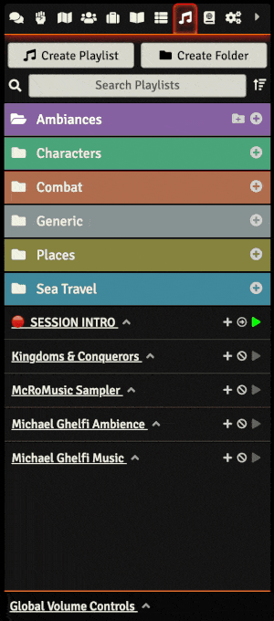

# Playlist Down

This Foundry VTT module changes the appearance of the playlist tab, moving the ‘Currently Playing’ and ‘Global Volume’ blocks to the bottom so they don't make the rest of the interface jump around when they change size. It also highlights the ‘Currently Playing’ block so it's easier to notice.

