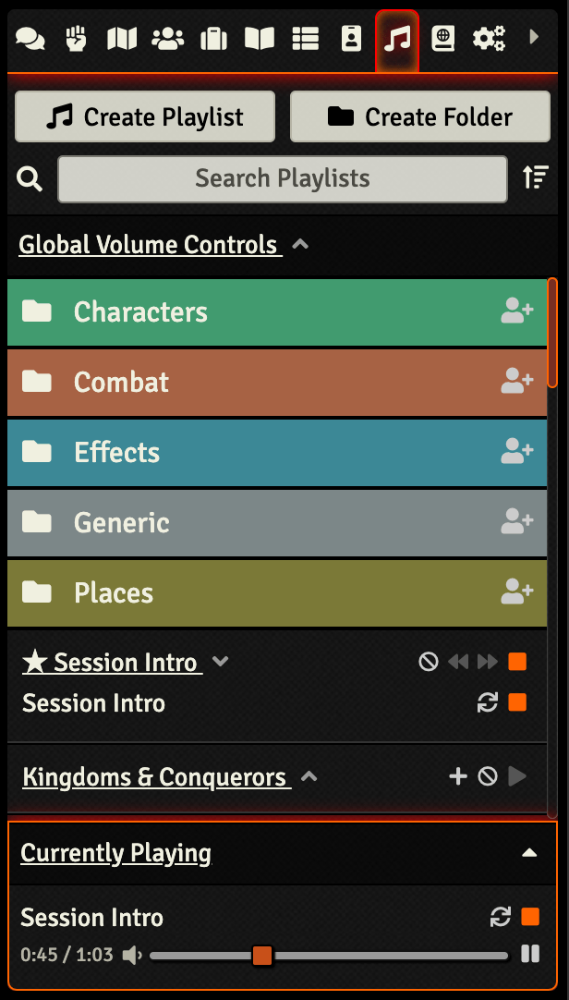
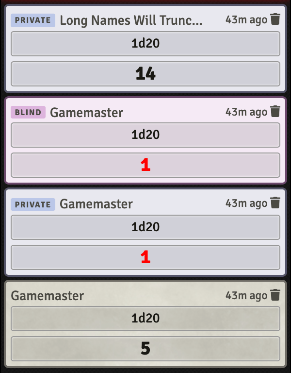

# Small Visual Tweaks (SVT)

Formerly known as ‘Playlist Down’, this module adds some small visual tweaks to Foundry's UI. It currently highlights the ‘Currently Playing’ tracks, truncates long names in chat, and adds badges to more easily identify Private/Blind Rolls and Whispers.

